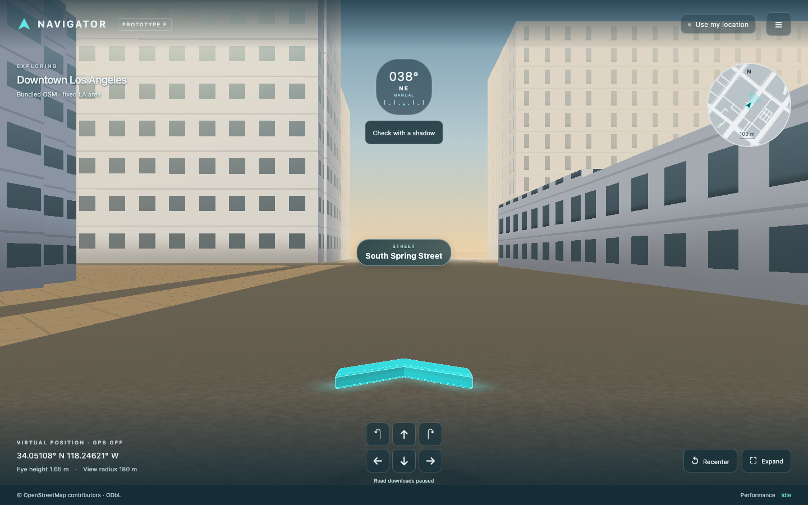

# Navigator

A GitHub Pages PWA for bounded, first-person exploration of real OpenStreetMap streets. **v0.1.18 · Prototype G** adds a near/far level-of-detail pass (full extrusion to 120 m, flat-shaded silhouettes to 300 m) and a timestamp-keyed driving position track, retaining the street-sector graph, bounded streaming, shadow alignment and the compass chevron. Sensors are off until you enable them; the app never requests a camera and does not provide route guidance.

[](https://stewalexander-com.github.io/navigator/)

- Live app: https://stewalexander-com.github.io/navigator/
- Architecture: https://stewalexander-com.github.io/navigator/architecture.html
- Local: `npm ci`, `npm run dev`, open the printed URL at `/navigator/`.
- Production: `npm test && npm run build`, then `npm run preview`.

## Controls

WASD translates, arrow keys turn/look, and dragging changes the view. Touch buttons support movement and turning. Recenter restores the starting pose. Manual exploration stays within 120 m of the loaded area's origin; scene visibility ends at 180 m.

**Use my location** (header or field guide) opens an explicit prompt, then requests Geolocation and, on iPhone, motion & orientation permission from that tap. While enabled, your real position moves the camera and your compass turns it; movement buttons hide. Drag left or right to look through a full 360° circle; release to ease back to the latest phone heading. A sweep across 80% of the screen covers one turn. GPS and compass keep updating while you hold the view. Tap **View: compass** to enter **View: free look**: drag or use the turn buttons while GPS keeps moving your position. Compass readings continue unchanged, and the chevron keeps its resolved compass bearing while you look around. Tap the same button to ease the view back to compass-follow. If the compass is denied or absent, drag and the turn buttons keep controlling heading. Recenter becomes **Snap** (jump to the latest fix). Toggling the button again returns to manual controls at the current place.

While the app is waiting on something — the bundled area at startup, a live square (download, parse, geometry build), the next square being prepared ahead, or the first GPS fix — the notice pill shows a tqdm-style progress strip: a label, a bar (filled when the total is known, sweeping when it is not) and a status line with percent, bytes read, transfer rate, an elapsed clock and the current phase or the reason a fix is still being waited for. The road-package footer line carries a thin fill bar while packages download.

The app starts with a bundled, real OSM area. The field guide offers an explicit live Overpass refresh, falling back to the OSM API if Overpass is unavailable (but never on a rate limit). Overpass can be unavailable or rate-limited; a failed refresh retains the current scene and the next live attempt waits 30 s, doubling per failure to 5 min with ±20 % jitter and never less than a readable `Retry-After`. Refreshed and GPS-downloaded building areas last for the current session. Road packages are independently downloaded from OSM via Overpass and stored locally in IndexedDB. The bundled area and shell work offline after the service worker finishes installation.

## Architecture and scope

Read `public/architecture.html` for the complete staged architecture, explicit adaptations, privacy model and platform limitations. MapLibre controls the true 1.65 m eye-height camera. A single Three.js custom layer batches extruded OSM footprints, ground and roads into three world draw calls, plus four for the hovering chevron. GPU shaders enforce distance fog and cutoff. OSM conversion and building triangulation run in a worker. Native `fill-extrusion` is deliberately replaced by this inspectable bounded renderer.

Buildings use real OSM footprints, including polygon holes. Missing height tags use simple defaults (12 m for a generic footprint; 6.5 m for a small generic footprint in residential context; per-type values for house-like types and outbuildings). Windows, road widths and the gable drawn on small rectangular homes are illustrative. No surveyed façade, terrain, collision detection, camera heading correction, or route engine is claimed in this stage. Sun correction requires the explicit shadow alignment described below.

## Budgets

90,000 building vertices; 160 buildings; 18,000 road vertices; 180 m rendered radius; 1.5 maximum device pixel ratio; 8 MiB response cap; one GPS square loaded at a time — 800 m centred on the fix at walking pace, growing 30 m of half-size per m/s above 3 m/s to a 2 km square centred six seconds of travel ahead at 13 m/s and above, stepping down 800 m → 500 m when a response is oversized or Overpass times out; the worker keeps up to eight parsed squares (16 MiB of source responses) for the session and, above 3 m/s, prefetches the next square eight seconds (at least 100 m) before the view radius reaches the edge. Complex buildings downgrade to bounding boxes under pressure before remaining distant features are omitted. Geometry replacement disposes old GPU buffers. Prototype E reuses cached chunk geometry; Prototype F supplies ingest-time street sectors for the bundled snapshot; broader buffer pooling remains future work.

Sensor thresholds (`src/sensors.js`): fixes worse than ±60 m are ignored; motion implying more than 15 m/s beyond the combined accuracy radii is rejected, recovering after three consecutive rejections or 30 s; position eases with a 0.55 s time constant and snaps above 45 m; heading eases with a 0.22 s time constant. When the receiver reports its own speed, the plausibility gate widens to 1.5 × that speed and the snap threshold to three fix intervals of travel, whichever is larger than the walking values; below 10 m/s and 15 m/s respectively nothing changes. Above 3 m/s the camera aims at the last fix advanced along the GPS course (dead reckoning, at most 2 s) and its heading blends from the compass toward the course, fully from 7 m/s or whenever the platform reports compass accuracy worse than 25°; at walking pace both rules are inert. The render loop sleeps once the pose settles within 1 cm and 0.05°, so a stationary user costs no frames.

Performance UI shows measurements, not hardcoded success values. Geometry byte counts exclude road buffers, browser and GPU overhead. The frame interval is requestAnimationFrame timing while moving, not GPU execution time. Total GPU memory is unavailable. Physical-device 15–20 minute sessions remain untested until recorded.

## Deployment

The Pages workflow installs the lockfile, runs tests, builds, uploads `dist`, and deploys. GitHub repository Settings → Pages must use GitHub Actions. Vite base, PWA scope and service worker scope are `/navigator/`. No API keys or environment secrets are required. App dependencies are bundled locally, not loaded from a CDN at runtime.

## Data and assets

OpenStreetMap data is © OpenStreetMap contributors, available under the ODbL: https://www.openstreetmap.org/copyright. The fixed snapshot's provenance is in `public/osm-provenance.json`; the raw OSM download is preserved in `public/osm-snapshot.json`. Do not replace this with fabricated data under an OSM label. `tests/fixtures/mebane-800m.json` is a second real Overpass response (fetched 2026-09-23, OSM base 2026-09-22T08:45:51Z) for the 800 m square Navigator requests around Elizabeth Lane, Mebane, NC — 153 buildings, 151 of them bare `building=yes` from `microsoft/BuildingFootprints` with no height, level or address tags — used by the unit and browser checks as a tag-poor suburban case; it is likewise © OpenStreetMap contributors under the ODbL. GPS areas are live Overpass/OSM API downloads of the square around your fix (800 m at walking pace, up to 2 km and centred ahead when driving); when a fix lies inside the bundled Los Angeles box, the bundled snapshot is reused instead of downloading, and a square already downloaded this session is reused without a request.

The supplied reference image is preserved unchanged and displayed rotated 90° clockwise on the architecture page using CSS. It is a reference, not the 3D scene background. It is excluded from the offline shell cache.

## Reproduce browser validation

Run `npx playwright install chromium`, start `npm run preview -- --port 4173` after building, then run `npm run test:browser`. Screenshots and raw measurements go to ignored `test-results/`. For Prototype C occlusion checks, also start `npm run dev -- --port 5173` and run `npm run test:chevron`; this checks partial/full/behind-wall cases and a real OSM wall through the production renderer. These checks cover movement, recenter, mouse look, dialogs, narrow-screen layout, same-origin startup requests, and a real offline reload. A second browser context grants geolocation and drives the real Geolocation API with Playwright fixes plus synthetic `deviceorientationabsolute` events: opt-in dialog, first fix, eased movement and travel course, temporary compass look-around with spring-back, an inaccurate fix being ignored, a walk that re-anchors a live square (Overpass answered with the bundled real snapshot), and stopping. A third context denies geolocation and must stay usable manually. A fourth context drives 30 s due north at 27 m/s (60 mph) with ±4 m fixes at 1 Hz and an in-car compass swinging ±30° at 10 Hz; because Playwright drops `coords.speed`/`coords.heading`, those fixes are dispatched through a page-side `watchPosition` shim. It asserts every fix is accepted, the view heading stays within 5° of the GPS course, a per-frame probe never sees a step above 10 m or any backwards motion, and the drive costs at most five Overpass requests. Results are recorded in `docs/validation.md`.

## Hovering chevron

A thin cyan chevron floats parallel to the ground at 0.75 m, 4.5 m ahead of the view. The camera remains at 1.65 m, so the horizontal glyph is visible from above. Body, edges, glow and ground shadow are depth-tested against the same building geometry as the world. It consumes the smoothed compass heading when available, including during free look; otherwise it uses manual view heading. Compass-follow uses the same smoothing for the camera. Free look changes only view direction, while retaining GPS position, compass observations and the chevron’s compass direction. GPS travel course remains separate and does not override the chevron. Prototype D can add a user-applied shadow-alignment offset to this same heading; camera fusion is deferred. This is heading indication, not route guidance or a measured travel direction. The total draw-call budget remains seven, including four for the chevron. See [Organic Maps ideas and implementation](docs/organic-maps-reference.md).

## GPS and compass (Prototype B)

Position uses `navigator.geolocation.watchPosition` with high accuracy; the Geolocation API exposes no polling rate, so adaptivity comes from filtering and from the idle render loop rather than from sensor duty cycling. Heading uses `deviceorientationabsolute` where available, otherwise `deviceorientation`; iOS supplies `webkitCompassHeading` and requires `DeviceOrientationEvent.requestPermission()` inside the enabling tap. Non-absolute `alpha` values are never treated as a compass. The facing direction is derived from the device rotation matrix by projecting the screen-up axis (device flat) or the rear-camera axis (device upright) onto the ground, whichever is longer, and correcting for `screen.orientation.angle`.

GPS course (`coords.heading`, used when `coords.speed` ≥ 0.6 m/s) sets the travel bearing for chunk prefetch at any pace. From 3 m/s it also enters the camera heading: the compass and course are blended on the circle with a weight that reaches 1 at 7 m/s, or immediately when reported compass accuracy is worse than 25°, because a magnetometer inside a moving car is the less reliable of the two. The chevron shares the fused heading, the Performance panel shows the blend, and the heading source reads GPS COURSE when the course dominates. Walking keeps the pure compass heading.

Hiding the tab stops the position watch and orientation listener; returning restarts them. Raw sensor samples live only in memory. Road-package coverage centers and map data are persisted on this device; no server of ours receives them. Enabling GPS sends the scene bounding box (an 800 m to 2 km square around or ahead of the fix) and requested areas within the 25-mile road target to Overpass or the OSM API, as stated in the prompt. Without an applied shadow alignment, compass heading is uncorrected and can be disturbed indoors or near vehicles. Camera correction remains deferred. Physical iPhone and Android walking results are not yet recorded; Chromium-driven checks are not a substitute.


## Sun cross-check (Prototype D)

Tap **Check with a shadow**. With GPS and compass enabled, stand still by a clear shadow from an upright object on level ground. Hold the phone flat, screen up, with its top edge pointing from the object's base toward the shadow tip. Tap **I'm aligned — check compass**. No need to look at the Sun. When shadows are unclear, indoors or under cloud, skip the check.

NOAA's approximate solar equations predict the true-north shadow bearing from position and UTC time. This independent user alignment enables comparison with the raw compass. Differences of 15° or more get a visible disagreement indicator; the difference may include magnetic declination, interference and alignment error. It is a recorded comparison, not continuous detection of compass drift or a heading-accuracy estimate.

**Apply temporary correction** is a separate, optional action. It adds the observed offset to the compass before existing circular smoothing; both camera and chevron consume that result. **Clear check and correction** restores the uncorrected compass. The check and correction clear on stale sensors, 10 minutes, 100 m displacement, screen rotation, disabling GPS or hiding the app. No camera, network, storage or new permissions are added.

Observation gates: GPS age ≤30 s; compass age ≤2 s; phone tilt under 20° on both axes; at least three readings spanning 400 ms with under 5° spread; solar elevation 10–75°. iOS-reported compass accuracy worse than 20° rejects recording. These thresholds are prototype choices, not calibrated accuracy guarantees. Readings are held in a bounded window (at most 16); solar math runs on status/input refresh, never in the render loop. A stationary GPS session refreshes status once per second; hidden/manual sessions have no timer.

Run `npm run test:sun` against production preview on port 4173 for the controlled daylight/disagreement/apply/clear/stale/night/offline flow. Its clock, GPS fixes and orientation are simulated; physical-phone accuracy remains unvalidated. Math source: [NOAA equations](https://gml.noaa.gov/grad/solcalc/solareqns.PDF). Independent numeric check: [NREL SPA Table A5.1](https://docs.nlr.gov/docs/fy08osti/34302.pdf). Navigator implements the lightweight NOAA approximation, not NREL SPA's precision algorithm.


## Chunk streaming (Prototype E)

The worker partitions the downloaded OSM area into 128 m buckets. Each building and road segment has one owning bucket; selection uses expanded feature bounds so large features crossing bucket boundaries remain candidates. At most 24 chunks intersecting the 180 m view radius plus a 12 m movement margin are active. Up to four additional chunks are prepared ahead of travel, within a 308 m reach. GPS course or accepted manual displacement supplies travel direction, with viewing heading used before movement.

Resident building geometry is cached and reused. Chunks outside the active/prefetch set lose their cache references and become eligible for garbage collection. Changed active geometry is transferred into a single building batch; roads into one road batch. The renderer disposes the previous GPU meshes on replacement. An unchanged active set sends no new geometry; under aggregate budget pressure, priority-order changes may trigger a new batch. The 180 m shader cutoff remains fixed. Initial active chunks are prepared before the bounded prefetch work in the same worker request.

Caps: 28 resident chunks; each cached building chunk ≤9,000 vertices / 16 buildings; each road chunk ≤600 vertices. Active batches still obey ≤90,000 building vertices / 160 buildings and ≤18,000 road vertices (the current 24-chunk road cap is 14,400). Complex footprints simplify under the per-chunk vertex cap; excess buildings and whole chunks that cannot fit the aggregate budget are omitted. The Performance panel exposes omissions. Chunk selection runs after roughly 12 m of movement or a 45° travel-direction change while the movement loop is active, not every frame. Draw calls remain seven.

Performance reports active/prefetched/resident counts, cache bytes, evictions/promotions, disposed meshes, source numeric-payload estimate and chunk update time. The geometry estimate is cached building typed arrays plus twice active building/road arrays (CPU plus an assumed GPU copy). It excludes temporary build/transfer copies, JS object overhead, shaders, textures, ground/chevron, MapLibre and driver allocations; it is not total memory. Source data is still parsed and retained for one whole downloaded area. This pass streams geometry within that area, not network chunks. Prototype F adds a precomputed sector graph for the bundled area; PMTiles range reads remain later work. The existing GPS download/re-anchor and failure behavior are retained.

Run `npm run test:stream` against production preview on port 4173 for an actual worker/renderer walk with browser-supplied GPS fixes. This verifies promotion, eviction, bounded counts, GPU disposal counters, idle reuse, same-origin requests and desktop/mobile performance layout. See `docs/validation.md` for measured results and physical-device limits.


## Level of detail (Prototype G)

Per chunk, not per building, so prepared geometry stays cacheable. Chunks within 120 m (plus the 12 m chunk margin) get full extrusion; a full chunk stays full until 144 m (24 m hysteresis), so walking along the boundary does not flicker. Chunks out to 300 m become silhouette prisms: the outer ring simplified (Visvalingam, corners under 1.5² m² dropped, at most 10 corners), walls and a flat roof, no holes or façade. Heights match the near field; a small gabled home's flat roof sits halfway up its near-field ridge. All silhouettes share one draw call (8 world draw calls, was 7), capped at 900 buildings / 40,000 vertices, 3,000 vertices per chunk.

Transition: the full-detail shader fades windows, doors, fascias and siding out between 90 and 150 m, and silhouettes use the same lighting with no façade, so crossing the boundary changes outline slightly, not surface. One fog curve now spans 105–294 m (was 63–176 m). Roads keep their 180 m reach and blend into the ground colour from 130 m so no road edge shows in the wider view.

Resource rule: a near chunk that would exceed the 160-building / 90,000-vertex full-detail budget is downgraded to silhouettes instead of being omitted. Bundled LA at the start pose: 12 full chunks (45 buildings, 5,463 vertices), 20 silhouette chunks (57 buildings, 3,150 vertices, 105 KiB), chunk update 21.6 ms cold / 1.8 ms warm in Node. Silhouettes are the "flat silhouette" option from the brief; textured billboard impostors are not used (they need offscreen rendering per building and add texture memory). OSM supplies no façade data, so distant façade detail is not lost information.

### Driving position track (v0.1.18)

Above 20 mph the camera lagged 7–22 m behind the car and could step backwards when fixes arrived late or in pairs, because dead reckoning ran from the moment a fix was *delivered*, not when it was *measured*. `createTrack` in `src/sensors.js` is a constant-velocity alpha-beta filter keyed on receiver timestamps (α 0.35, β 0.08, Doppler speed/course weighted 0.7). It predicts to "now" on the receiver clock using the smallest delivery delay seen in the last eight fixes, and leads by the 0.55 s easing constant to cancel the easing lag. A fix older than the current state is ignored; a gap over 4 s or a residual over 3 × the snap threshold restarts the track. Below 3 m/s it returns the raw fix, so walking is unchanged.

`npm run sim:drive` (60 s drives, 1 Hz, σ 2.5 m, 100–400 ms latency, ±150 ms jitter, 8 % batched deliveries; mean of five seeds): at 20 mph along-track lag −7.19 → −0.99 m, RMS 7.49 → 1.70 m, worst backward frame 0.32 → 0.02 m; at 60 mph lag −21.45 → −2.81 m, RMS 21.87 → 3.83 m. Cross-track p95 rises slightly at speed (3.77 → 3.44 m at 20 mph, 4.13 → 5.79 m at 60 mph) from extrapolating course noise. These are synthetic; real receivers may differ, which is why the Performance panel now has **Download sensor log**: the last 600 fix deliveries (receiver and delivery times, metres from the first fix — no coordinates — accuracy, speed, course, compass, view heading, course blend, track state), held in memory only and exported only on that tap.

## Street-sector index (Prototype F)

`public/osm-sectors.json` is generated offline from the unchanged bundled OSM snapshot. It contains 14 street-derived polygon faces, 28 shared-boundary adjacency links, memberships for all 60 existing chunks, and a point-location table. Ground-level primary/secondary/tertiary/residential/unclassified/living-street/pedestrian centerlines define the faces; bridges, tunnels and nonzero layers are excluded. The source envelope closes the outer faces. These are derived rendering sectors, including fringe faces, not surveyed blocks or a walkable route graph.

The worker verifies the source SHA-256, origin, graph structure/connectivity and complete chunk memberships before use. It locates the player's face using the prebuilt locator, traverses adjacent faces intersecting the query bounds, and then applies the existing exact chunk-bound distance and resource filters. Precomputed memberships also avoid rebuilding the bundled spatial buckets. The graph is cached with the offline app shell. Live GPS/refresh downloads, stale/missing graph data, unavailable source hashing and point-location failures retain the existing radius lookup; no street polygonization or graph construction runs on the device.

The Performance panel shows lookup mode, visited sectors, candidate chunks, graph bytes and lookup time. `npm run bench:sectors` verifies equality at 441 positions and measures both query paths over 8,820 queries. On this small dataset the graph is slightly slower: about 0.0115 ms/query versus 0.0075 ms for the radius scan in one local run. The initial-area query visits all 14 faces and collects all 60 chunks, so no speedup is claimed. Both paths preserve identical active/prefetch sets and geometry in the tested walks.

Rebuild the artifact only when ingesting source changes:

```sh
python3 -m venv /tmp/navigator-ingest
/tmp/navigator-ingest/bin/pip install -r scripts/requirements-ingest.txt
NAVIGATOR_PYTHON=/tmp/navigator-ingest/bin/python npm run ingest:sectors
npm run check:sectors
npm run bench:sectors
```

The ingest step uses Shapely/GEOS to node street lines and polygonize their faces. It runs locally/build-time, never in the PWA. `npm run build` checks the committed artifact against the snapshot; CI does not need Python or Shapely. The derived graph remains covered by the existing OSM attribution/ODbL notice. The source snapshot and supplied image remain unchanged.

`npm run test:free-look` checks default compass-follow, independent drag/turn while GPS moves, unchanged raw compass readings, compass-directed chevron during free look, return to follow, mode reset when GPS stops, phone layout and stale-graph fallback. The view defaults to compass-follow on every GPS enable; manual and denied-compass behavior remain available. The performance panel distinguishes sensor bearing from the view heading.

### Street label

A second, amber pill (`#indoor-pill`) appears only when a GPS fix lies confidently inside a loaded footprint; see “Indoor hint”.

A compact translucent pill floats centered at the camera’s 1.65 m eye level, clearly above the 0.75 m chevron in demo and GPS modes. It uses named OSM street/path segments retained through both chunk lookup paths, matching player position to rendered road surfaces rather than viewing direction or centerline distance alone. A named street containing the position takes precedence over a nearby unnamed footway. This remains approximate matching, not route guidance. Small distance hysteresis reduces intersection flicker. Missing names and unmatched street geometry are explicit; no reverse-geocoding service or additional permission is used.

The pill ignores pointer input, has bounded width and text overflow, and hides when its anchor approaches the upper sightline or bottom controls. It is a screen overlay for map context; unlike the chevron, its text is not occluded by buildings. Run `npm run test:street-label` for demo/live labeling, phone bounds and drag-through checks.

### Local OSM road packages

Road downloads begin near the demo/current GPS location and target a 25-mile radius. At 12.5 miles from the download center the plan recenters, reusing completed overlap. Packages are downloaded serially from public Overpass, validated, compressed and saved in this browser's IndexedDB—not uploaded to GitHub. Completed areas resume across reloads; dense areas subdivide. The field guide offers pause/resume, retry/cache this area and clear. A saved GPS region is kept on startup until GPS is enabled or another area is explicitly selected.

The separate road-cache limits are 128 MiB stored payloads, 4 MiB per response, 16 MiB per decoded package, and 2,400 active segments within 300 m; the renderer still cuts off at 180 m. Worker maintenance after roughly 25 m movement (or four seconds of travel above 5 m/s, about 108 m at 60 mph) removes packages extending outside the current 25-mile radius, conservatively removing whole edge packages. Each in-range package is gunzipped, SHA-256-verified and parsed once per session and then held decoded in the worker until it leaves the 300 m view range or is evicted; the plan record is written to IndexedDB only when it changes. Metadata, transient objects and browser/GPU overhead are additional. The bundled demo and app shell remain available separately.

If GPS is enabled while already moving above 8 m/s and no GPS-centred plan exists yet, the 25-mile bulk download is held: the footer reads "Roads · paused while driving · tap Cache this area", and the plan starts after a minute below 3 m/s or when you tap **Cache this area / retry**. Walking, desktop fixes without a speed, and an existing GPS plan are unaffected.

The footer reports completed areas, stored bytes and download state. This is a target, not guaranteed complete coverage: public-service outages, rate limits, quota and conservative edge eviction can leave gaps. Road names also depend on OSM tagging and approximate position matching. Full-radius transfer measurements and physical-phone offline walking remain unverified. Building downloads keep their existing small-area behavior.

Run `npm run test:road-cache` against production preview for installation, real IndexedDB persistence, offline reload, multi-tab access, clear and phone-layout checks with controlled OSM responses. Implementation decisions, evidence and limitations: [five-pass Organic Maps review](docs/road-cache-review.md).

### Autumn afternoon materials (v0.1.7)

Neutral pale stone, warm directional highlights, cooler shaded faces and a blue-to-gold sky replace the gray scene. Glass uses an analytic sky/ground reflection, a grazing-angle tint and a compact sun highlight; recessed pane edges and base shading add depth. Roads use a restrained grazing sheen and distance/footprint-filtered aggregate grain. The sky is a static CSS gradient behind the transparent canvas.

These are illustrative lighting/material cues, not current sunlight, cast building shadows or reflections of actual nearby geometry. The compass and explicit Sun cross-check remain independent. No textures, texture downloads, extra meshes, shadow maps, reflection buffers or post-processing passes are added. The seven world/chevron draw calls and geometry caps are unchanged; fragment shader math increases modestly. Physical-phone GPU cost remains unmeasured. Browser movement/offline/GPS, street-label and GPU chevron-occlusion checks pass.

v0.1.8 separates the neutral façade pigment from warm incident sunlight, adds a broad stone highlight, and reduces amber glass/haze tint. Buildings remain cool-neutral in shade instead of brown.

v0.1.9 precaches app-shell assets with a build-specific network URL and stores them under their canonical offline keys, preventing a newly installed shell from retaining stale HTML from the HTTP cache.

### OSM building styles (v0.1.10)

Seven procedural styles share the same mesh and shader: neutral, small home, apartments/residential, storefront, office, utility/warehouse, and civic. They vary window spacing/proportion, floor rhythm, glazing and simple wall treatment. Neutral pale materials and warm sunlight remain. Known homes use smaller spaced windows, civic façades narrow tall windows, and utility buildings broad minimally glazed walls. Tagged retail gets display glazing and a plain fascia on one nearby street-facing outer wall. A shop tag on apartments adds only the ground-floor frontage.

Classification runs once when the area is parsed. Explicit building type wins; building-use, shop, office and amenity tags can resolve generic buildings. Generic commercial does not imply office. For otherwise unspecified footprints, contained residential/retail/industrial land-use polygons provide a marked inference; only in residential context do height and footprint size distinguish a small home from a larger residential building. City names, wealth, demographics and address strings are not classifiers. Unknown or unsupported types stay neutral. Explicit unusual structures are not overridden by neighborhood inference.

Land-use polygons are included in the existing bounded live OSM area request, not downloaded per building. At most 128 polygons with 2,048 points each are used, including multipolygon components and excluding holes. The smallest matching polygon is preferred. Neighborhood inference uses the footprint-bounds center and can be wrong on a zoning boundary. Standalone shop POIs are not joined to buildings. Frontage checks at most 128 outer edges against 64 nearby road segments; ambiguous/distant or simplified footprints may omit the shopfront. Existing footprints are preserved; since v0.1.14 small rectangular homes carry an illustrative gable (see below) and small untagged footprints in residential context default to two storeys. No balconies, landmarks, occupants or business signs are invented.

Each building vertex adds two unnormalized bytes: style/frontage code and quantized floor height. At the 90,000-vertex cap this is 180,000 additional bytes per active buffer (CPU and GPU copies are separate). Chunk cache and worker transfer accounting include the attribute. There are no new textures, material batches, draw calls or per-frame classification. Land-use tags can increase source-response size, which remains capped at 8 MiB. More shader branches add some GPU work; physical-phone cost remains unmeasured.

Validation: 49 unit tests, a seven-style GPU fixture with unique rendered output, mixed-use frontage, browser movement/GPS/offline checks, streaming and chevron occlusion. The bundled snapshot yields 47 neutral, 26 residential, 28 retail-cued, three office, 13 utility and five civic buildings. These are visual classifications, not surveyed use guarantees. Run `npm run test:building-styles` with the dev server on port 5173.

Tag semantics: [OSM building](https://wiki.openstreetmap.org/wiki/Key:building), [building use](https://wiki.openstreetmap.org/wiki/Key:building:use), [land use](https://wiki.openstreetmap.org/wiki/Key:landuse).

### Driving-speed sensor rules (v0.1.11)

The 15 m/s plausibility gate was a walking constant applied to cars: with 1 Hz fixes it accepts at most 15 m/s plus twice the reported accuracy, so at 27 m/s a good receiver (±3–6 m) had three of every four fixes rejected as implausible and the fourth forced through as "recovered", a 108 m jump every 4 s that exceeded the 45 m snap threshold and teleported the camera. Better accuracy made it worse. The camera heading was also 100 % magnetometer, inside a steel car body.

Four additive rules in `src/sensors.js`, each derived from `coords.speed` and inert without it or below walking pace: the gate allows max(15 m/s, 1.5 × reported speed); the snap threshold is max(45 m, 3 × speed × fix interval); from 3 m/s the eased target is the last fix advanced along the course for up to 2 s (dead reckoning); and from 3 m/s the camera heading blends from compass toward course, fully at 7 m/s or when compass accuracy is reported worse than 25°. Manual mode, walking GPS and the bundled area behave exactly as before; the desktop Playwright fixes carry no speed and exercise the unchanged path.

### Overlay layout (v0.1.17)

No pill may sit on top of another, whatever the viewport. `src/layout.js` is a small pure resolver: anchored UI (brand and header buttons, area name, compass, minimap, bottom bar, footer, performance panel) are obstacles; the sun button, view-mode button, notice (with its progress strip), indoor pill and road-status line are placed in that priority order, and the street pill is placed per frame against the cached result. Each pill keeps its designed CSS position when that is free; otherwise it moves vertically to the nearest free slot in its own column (ties move down, away from the compass); only when no slot in the column can hold it does it shrink into the largest gap, never below 60 %. The resolver runs once per UI tick or layout change (about 5 Hz while moving, on notice/pill changes and on resize), not per frame; the street pill's per-frame step is a handful of rectangle tests against cached obstacles. The Performance diagnostics expose `layout.overlaps` (pairs of visible overlays that intersect) and `layout.fixedOverlaps`; both must be zero.

Validation: 80 unit tests (four new: free space keeps the designed position and ignores obstacles outside the column; nearest-slot moves below/above with tie-break and viewport clamping; shrink into the largest gap centred with the 60 % floor; overlap counting). The browser check asserts zero overlaps in the manual and GPS phone layouts and, in the Mebane context with the notice, indoor pill and street pill all visible, at 1440 × 900 (nothing moved), 390 × 844 (indoor pill moved below the notice at full size) and 390 × 600 (indoor pill shrunk to about 66 % because no slot fit). Screenshots `layout-phone.png` and `layout-short-phone.png`.

### Indoor hint (v0.1.16)

When an accepted GPS fix falls inside a loaded OSM footprint, an amber pill under the view-mode button says so — with a stated confidence. The worker answers each accepted fix (at most one per fix, ≤ 1 Hz) with the footprint containing the fix and how deep inside it the fix sits (distance to the nearest edge, holes included); `src/indoor.js` turns that into a verdict: depth of at least one accuracy radius → "You are probably inside a home" (HIGH CONFIDENCE); at least 0.3 radii → "You may be inside …" (LOW CONFIDENCE); shallower, or moving faster than 3 m/s, → nothing. The pill names the building when OSM does (`name`), otherwise its inferred style (a home, an apartment building, a shop building…), and hides after two consecutive fixes without a verdict so an edge does not flicker. A ±60 m fix inside a 10 m house is therefore never called "inside". Cost: a bounds scan plus one point-in-polygon in the worker per fix, one small message, one DOM update; no geometry, draw calls or per-frame work, and nothing leaves the device. This is a hint from GPS geometry and footprints, not indoor positioning: multipath near tall walls can place an outdoor fix inside a footprint and a courtyard fix outside one.

Validation: 76 unit tests (three new: edge depth with holes and bounds rejection; verdict gating by depth/accuracy/speed and building naming; the real Mebane fixture — the centre of `way/1179878853` is "probably inside a home" at ±4 m, "may be" at ±12 m, nothing at ±40 m, a road is outside, and `Lambs Chapel` is named). The worker test covers the `locate` message and frame check. The Mebane browser context starts at that house with a ±4 m fix, asserts the pill's text and HIGH CONFIDENCE label, then hides it after two ±40 m fixes, and confirms no verdict during the 27 m/s drive.

### Progress feedback (v0.1.15)

GPS acquisition and area loads had no visible progress: a first fix can take tens of seconds outdoors, and a live square is a multi-second download followed by parsing and geometry work, during which the pill said only "Downloading…". The worker now posts `progress` messages while a body streams (bytes read and the response's `Content-Length`, throttled to about every 120 ms), then `parsing` and `building` phases; `main.js` renders one task at a time inside the notice pill (`#progress`): a label, a bar and a tqdm-like line (`42 % · 1.20 / 2.85 MiB · 0.41 MiB/s · 00:03 · parsing OSM data`). The bar is determinate only while the bytes read stay within the declared `Content-Length`; OSM services usually compress JSON in transit, so the decoded count overtakes the header and the bar switches to an indeterminate sweep with the byte count and rate still shown. GPS acquisition shows an elapsed clock from the enabling tap to the first accepted fix, with the last rejected fix's accuracy and reason (for example "last fix ±120 m (too inaccurate, need ±60 m)"). Prefetches ahead of a car show as "Preparing the next area ahead". The road-package footer gains a two-pixel fill bar (completed / planned tiles) while downloading. The strip respects `prefers-reduced-motion` (a pulse instead of a sweep), exposes `role=progressbar` with `aria-valuenow` when determinate, and adds no per-frame work: the clock ticks at 4 Hz only while a task is visible.

Validation: 72 unit tests (four new: `progressFraction`'s Content-Length trust rule, the status-line wording, rate sampling and smoothing; and the worker's `progress` messages ordering downloading → parsing → building with monotonic byte counts, prefetches tagged as such, and a cache hit reporting only the build). Browser checks assert the strip is hidden once the bundled area is ready, visible with an elapsed clock between the GPS enabling tap and the first fix, visible with the "Downloading the OpenStreetMap area around you" label while a routed Overpass answer is deliberately held for 1.5 s, and hidden again once the area is live.

### Houses in tag-poor OSM (v0.1.14)

In a real 800 m square around Elizabeth Lane, Mebane, NC, 151 of 153 buildings are bare `building=yes` with no height, level, address or land-use context beyond two `landuse=residential` polygons. `height()` gave every one of them the 12 m generic default, and because the residential land-use rule compared that default against a 10 m threshold, "home" was unreachable for any untagged footprint: the square rendered as 85 four-storey "apartments" and 63 office-like "neutral" blocks. Four additive changes:

- **Height default with evidence.** `height(tags, {residential, area})` returns 6.5 m (two storeys) for a generic footprint of at most 250 m² in residential context; house-like types (`house`, `detached`, `semidetached_house`, `terrace` 7 m; `bungalow`, `cabin` 4 m; `garage`, `garages`, `shed` 3 m) have their own defaults; everything else keeps its previous value. `hasHeightTag` marks whether a height is evidence or a default, and the classifier receives `heightDefault`.
- **Footprint rule in residential land use, and a road-context fallback without it.** With the honest default the existing rule (`height ≤ 10 && area ≤ 250`) now yields "home" for small untagged footprints inside residential polygons (evidence `footprint inference`). Where no land-use polygon exists, a generic footprint of at most 250 m² with a default height and no shop/office/amenity tag, whose nearest non-footway road within 60 m is `residential`, `service`, `unclassified` or `living_street`, is a home — but only in a square whose generic footprints are mostly small (at least eight, at least 70 % under 250 m²). Downtown Los Angeles fails that prior (6.6 % small), so nothing there can change; the bundled snapshot classifies exactly as before (47 / 0 / 26 / 28 / 3 / 13 / 5) and the start view is pixel-identical.
- **Home façade.** Style 1 draws one row of narrower windows per 2.9 m floor, a front door in the first bay of the street-facing edge (the same nearest-street search the shopfront uses; code 16 + kind, distinct from the shopfront's 8 + kind), faint horizontal siding lines, flat dark panes without the sky tint and glint, and a darker roof.
- **Gable on small rectangular homes.** A home whose outer ring has four points and at most 250 m² gets a ridge along its longer axis at 0.29 × the short side (about 30°): two sloped quads and two vertical gable triangles, 18 vertices instead of 6, still within the per-building vertex estimate. Other footprints and styles keep flat roofs.

Mebane now yields 120 homes, 24 neutral, 4 apartments and 5 civic (the tagged church, chapel and places of worship); nothing is inferred as an office. These remain visual inferences from footprint size and street context, not surveyed use; the 250 m² footprint, 60 m reach, 70 % prior and 0.29 gable rise are documented defaults.

Validation: 68 unit tests (five new: height defaults and `hasHeightTag`; the residential land-use rule reachable with a default height while explicit tags win and homes get 2.9 m floors; the road-context fallback's every gate including street class, prior, height evidence, footprint size and commercial cues, plus `nearestRoadClass`; the real Mebane square ≥ 120 homes and 0 offices alongside the exact unchanged Los Angeles histogram and its 6,903 start-view vertices; gable geometry, normals, ridge height, door and shopfront codes, flat roofs for other shapes and styles, and 160 gabled homes under budget). `npm run test:building-styles` renders the home sample as a 14 × 12 m gabled house with a door and still finds seven distinct styles. The browser check adds a Mebane context: the fixture answers Overpass, the loaded square reports 120 homes / 0 offices with the small-footprint prior, and a 12 s drive north at 27 m/s accepts every fix with a maximum per-frame step of 1.20 m and no backwards motion. Before/after screenshots of the bundled Los Angeles start view differ in 0 of 1,296,000 pixels.

### Drive-friendly building squares (v0.1.13)

At 27 m/s the fixed 800 m square, re-fetched when the 180 m view radius touched its edge, was exhausted every 220 m — a fresh 166 KB Overpass download every eight seconds in a suburb, nothing cached, nothing prefetched, a flat 30 s hold after any failure (810 m of fog), and an immediate second request to the OSM API on a 429. Four additive changes in `src/world.worker.js`, `src/sensors.js` and `src/main.js`:

- **Session cache.** The worker keeps the last eight parsed squares (bounded to 16 MiB of source responses). A load whose fix is covered by a held square with the full 180 m margin reuses it with no request; the explicit **Refresh** button bypasses the cache. Driving back over the same road costs nothing.
- **Prefetch at the edge.** Above 3 m/s, when the remaining runway to the edge is under eight seconds of travel (at least 100 m), the next square is downloaded around the point eight seconds ahead and stored in the cache; the ordinary edge swap then hits the cache. Walkers keep the swap-at-the-edge behaviour.
- **Speed-sized, course-led square.** `liveSquare`: 400 m half-size at walking pace; above 3 m/s it grows 30 m per m/s to a 1,000 m cap and the centre leads the fix by six seconds of travel along the course. In Mebane at 60 mph that is one 2 km square about every minute instead of an 800 m square every eight seconds. Dense or oversized responses step down 1,000 → 400 → 250 m on Overpass.
- **Backoff and Retry-After.** A failed live load waits 30 s, doubling to a 5 min cap with ±20 % jitter, reset on success. 429/503 responses read `Retry-After` (seconds or HTTP date, 60 s if the header is absent or, as is common cross-origin, not exposed) and never fall through to the OSM API; a rate limit means slow down, not switch providers. 504 and Overpass timeout remarks try a smaller square first; only the smallest still-dense square gets one OSM API attempt, and other failures keep the original fallback.

Walking-pace fixes (or fixes without a speed) produce the same 800 m square centred on the fix, requested at the same moment as before, with the same single 500 m retry; the bundled Los Angeles box is preferred exactly as before.

Validation: 63 unit tests (eight new). `tests/world-worker.test.mjs` hosts the real worker in Node with a scripted `fetch`: one download per square then reuse for any covered fix, refresh bypass, prefetch then cache-hit swap, count and byte bounds with oldest-first eviction, 429 with numeric and date `Retry-After` and a bare 429 defaulting to 60 s with no OSM API call, and the 1,000 → 400 → 250 m step-down on 504 and timeout remarks. `tests/sensors.test.mjs` covers `liveSquare`, `edgeRunway`/`shouldPrefetch` and `retryDelay`. The 60 mph browser drive now asserts the prefetch fires while the bundled area still covers the fix, the edge swap reuses the 2 km square, and the whole 835 m drive costs exactly one Overpass request (three in v0.1.11–12); a new rate-limit context answers 429 with an exposed `Retry-After: 45`, and the app waits 45 s, keeps the bundled scene, sends no OSM API request and no second Overpass request during the hold.

### Road-cache churn at speed (v0.1.12)

At 27 m/s the 25 m maintenance threshold fired about once a second, and every call gunzipped, hashed and re-parsed the in-range multi-megabyte package (about 67 ms per call on a desktop CPU for a real 3.16 MB Mebane tile) and rewrote the plan record. Enabling GPS in a moving car also began the 69-tile, 5 s-spaced bulk plan immediately, so the footer read "downloading" for the first seven-plus minutes of a drive. `RoadCacheEngine` now keeps decoded packages per session (bounded to the in-range set, dropped on eviction, verified once), skips identical plan writes, and `main.js` spaces position updates by four seconds of travel above 5 m/s and holds the bulk plan while driving as described above. Walking behaviour, the 25 m threshold below 5 m/s, and packages already installed are unchanged.

Validation: 55 unit tests (two new: a counting store proves one `get()`/decode across five position updates 30 m apart, eviction beyond 300 m, re-decode on return, and seeding from a fresh download; the plan record is saved only on change). The 60 mph browser drive now starts already moving and asserts the hold engages, no GPS plan is created during the drive, and the Cache this area tap releases it. `npm run test:road-cache` passes unchanged. The per-call `view()` cost after this change was not re-measured on the real tile.

Validation for v0.1.11: 53 unit tests (four new: the 60 s / 1 Hz drive table at 27 m/s with 3, 5 and 6 m accuracy accepting 60 of 60 while the speedless baseline still accepts 15; snap scaling; dead reckoning limits; fusion weights and circular blend) and the 60 mph browser drive described above. In the recorded local run the drive sampled 2,019 frames with a maximum per-frame step of 1.64 m, no backwards motion, 31 of 31 fixes used, heading within 0.001° of the course against a ±30° compass, and three Overpass requests over 835 m. Physical in-car behaviour, real receiver speed/heading quality and magnetometer disturbance remain unmeasured.
